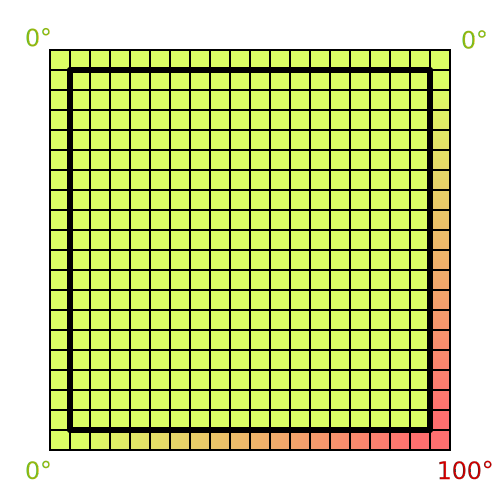

# IHPCSS Challenge #

You are taking part to the [International High-Performance Computing Summer School](http://ihpcss18.it4i.cz/) coding challenge? That's where it starts!

## What is the challenge? ##

The calculations performed in this Laplace application consist in propagating the temperature from a cell to its neighbours. Initially, the temperatures are defaulted as 0 except:
* The bottom-right corner which starts at 100 degrees.</li>
* The right boundary, where the temperature linearly decreases from 100 to 0 as we move upward.</li>
* The bottom boundary, where the temperature linearly decreases from 100 to 0 as we move leftward.</li>

The illustration below shows the initial temperature values. The boundaries are represented outside the square with the thick border, the cells to process are inside that same square.
<p>
  
</p>

## What is this repository for? ##

* You will find here everything you need to compete; source codes, makefiles, documentation, scripts, tests...
* It provides you with a pre-setup experimental protocol that allows to compare experiments fairly.
* This repository serves as the formal challenge setup; it makes sure contestants compete in the same conditions.

## How do I get set up? ##

* Download: ```git clone https://github.com/capellil/IHPCSS_Coding_challenge.git```
* Installation: ```make```
* Run the experiments: ```./run.sh```
* Submit your version to the challenge: ```./submit_my_version.sh```

## What kind of optimisations are not allowed? ##

* Reducing the amount of work to be done such as ignoring the cells whose value will be zero during the entire simulation.
* Removing the track_progress from the loop or changing the frequency at which it prints.
* Bypassing the buffer copy using a pointer swap.
* Decreasing the accuracy of the calculations by switching from doubles to floats.

## Who do I talk to? ##

* Repository owner
* IHPCSS Coding Challenge organisers

## Acknowledgments ##
* [John Urbanic](https://www.psc.edu/staff/urbanic)
* [David Henty](https://www.epcc.ed.ac.uk/about/staff/dr-david-henty)
